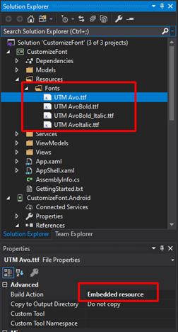

# Embedded font
Embedded font in globals
Customize Font in Local resource by embedded


# Add the font file (otf or ttf) to your shared project and mark it as embedded resource



# Add Font to Assembly project  (AssemblyInfo.cs):
```
[assembly: ExportFont("UTM Avo.ttf", Alias = "UTM Avo")]
```
# Using in global
Resource App.xaml
```
<Style TargetType="Label">
<Setter Property="FontFamily" Value="UTM Avo"></Setter>
</Style>
```
# References:
https://devblogs.microsoft.com/xamarin/embedded-fonts-xamarin-forms/
